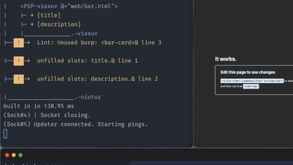

# Pukable Slot Pockets

Pukable Slot Pockets is my personal strat for declarative frontend components.
Instead of transforming a custom component extension into Javascript/JSX and then
into HTML, it constructs a very loose concept of a plan of the DOM and injects other
HTML files in tandem using Declarative Shadow Root, `<slot>` tags, and a `<!slurp>`
declaration loosely based on the HTML Modules proposal.


## Hot Reloading

On startup, PSP boots a webserver on port 3003 as well as a WebSocket hot reload server.

You can view `web/index.html` in the browser by going to `https://localhost:3003`.
Similarly, if you created a new file at `web/foo/bar/index.html`, you can navigate to it by
`https://localhost:3003/web/foo/bar`. When you make a change to the underlying HTML file or
any of its dependencies in your text editor, the page opened in the browser will refresh.


## Slurping and Burping

An HTML file served by PSP can include a `<!slurp>` declaration. It has two attributes:
`from` and `as`. 

`from` determines from what file you'll be spitting tags into the file you're working on.
Like other path attributes, the paths specified are relative to the file. You can include 
fragment identifiers in the path.

`as ` determines what tag name you'll use as a stand-in for the borrowed markup.

For example, you might have this as a slurp declaration:
```html
<!slurp from="../to/b.html#foobar", as="name-here">
```

Here, tags are slurped up from the `b.html#foobar` file in the `to` subdirectory of the
containing folder, and wherever you include `<name-here></name-here>`, that markup will
be burped out into the page.

If there is no `#fragment` in the path of the `from` attribute, the `<body>` tag of the 
target will become the slurpee. If there's no `<body>` (for example, you just have an
HTML snippet in the file), the entire file will become the slurpee.

## Slotting and Bubbling

Suppose `bar.html` has the following content:

```html
file: bar.html
~~~~~~~~~~~~~~
<h1>Phrasebook</h1>
<p>
Here are some handy phrases for when you travel to <slot name="location">Texas</slot>.
</p>
<ul>
    <li><slot name="greeting">(Series of gunshots) Yeehaw. Howdy y'all.</slot></li>
    <li><slot name="departure">Well, I reckon I'm hitting the dusty trail.</slot></li>
</ul>
```

The `slots` specified are default content. When you `<!slurp>` this file into another
(say, `my-guide-to-vermont.html`) and use `phrase-book` for the `as` parameter,
you'll include this content with the `<phrase-book>` tag.

If you then add `<phrase-book></phrase-book>` to your page, the output of the PSP program 
will prompt you to override these defaults:
```
|-- ! ->  unfilled slots: location.@ line 3
|-- ! ->  unfilled slots: greeting.@ line 6
|-- ! ->  unfilled slots: departure.@ line 7
```

Try providing some markup with `slot` attributes to satisfy this demand:

```html
`<phrase-book>
    <span slot= // todo
</phrase-book>`
```


PSP will parse other HTML files that `<!slurp` bar under a name, and interpolate slot contents
`bar.html`'s content:


For this file, the server will stream to the client, in order:

1) All content up to the inner `<body>` of the host file:
```html
<!doctype html>
<html lang="en">
  <head>
    <title>No title</title>
  </head>
  <body>
```

2) A `<psp-host>` opening tag, and a `<template shadowrootmode="open"`> declaration;
3) Any `<style>` tags used by PSPs, having their contents combined;
4) The `<!slurp>` declaration is skipped, and not included in the output;
5) Everything up to, but not including, the `<foo-bar>`instance opening tag:
```html
    <section>
      <p id="perry">Regular top-level DOM content</p>
```
6) The contents of `bar.html`:
```html
<h1>My favorite sentence</h1>
<slot name="greeting">Hello there y'all</slot>
```
7) The `</foo-bar>` instance closing tag, is skipped, and not included in the output;
8) The `<template>` tag opened in step 2 is closed, any tags utilizing slots are streamed (in this case, the span using `greeting`), and the `<psp-host>` tag is closed:
```html
    </template>
    <span slot="greeting">Bonjour, le monde!</span>
</psp-host>
`````
9) The rest of the file.

Due to how `<template shadowrootmode="open">` works, the browser will substitute the placeholder content `Hello there y'all`
with `<span>Bonjour, le monde!</span>` as soon as the client receives the `<span>` tag in the stream.

# Installation

PSP has no JavaScript dependencies for running other than a TypeScript interpreter for node versions <23.

## Running
1) TypeScript
    a) Node >= 23: 0 dependencies, run the server with `node ./server.ts --experimental-strip-types=true`.
    b) For Node versions under 23, PSP depends on `tsx` to execute. Run `npm install` to install and `npm run dev` to start the server.
2) HTTPS
Any method of generating a local certfile will work.
The cert should be named `localhost.pem`, and the key should be named `localhost-key.pem`.
Both should be located or symlinked in the project directory adjacent to `server.ts`.

[mkcert](https://github.com/FiloSottile/mkcert) is a convenient program for cert generation:

On macOS, install with brew:
```bash
$ brew install mkcert
```

On Windows, use Chocolatey:
```
choco install mkcert
```

or use Scoop

```
scoop bucket add extras
scoop install mkcert
```

After installing, run:
```
mkcert install
mkcert localhost
```
Ensure `localhost.pem`, and the key, `localhost-key.pem`, are in the `psp` folder.

[See the mkcert repo for more documentation.](https://github.com/FiloSottile/mkcert)

## Testing
After running `npm install`, use `npm run test` to test with Vitest.

