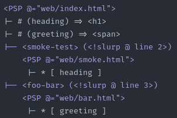
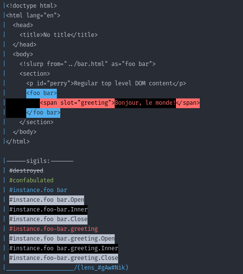

# Pukable Slot Pockets
Pukable Slot Pockets is an experimental frontend tool for declarative templating within HTML using syntax loosely based on the HTML Modules proposal.

On execution, it starts a local HTTP server with hot-reloading over WebSockets, which streams
HTML files piece-by-piece to `https://localhost:3003`

It introduces a `<!slurp from="src/to/b.html#foobar", as="name-here">` declaration, which creates a scoped import resolution applicable to an entire `.html` file regardless of its position.

The `from` parameter is a relative link to an HTML fragment or file in the `src` folder.
If there is no `#fragment` in the URL, the `<body>` tag of the target will become the slurpee.

All appearances of the `as` parameter (for example, `<name-here></name-here>`) will then
be replaced with the inner content of the fragment referenced by `from`.

Suppose you have the following content in a file called `bar.html`:

```html
file: bar.html
~~~~~~~~~~~~~~
<h1>My favorite sentence</h1>
<slot name="greeting">Hello there, y'all</slot>
```

PSP will parse other HTML files that `<!slurp` bar under a name, and interpolate slot contents
`bar.html`'s content:



For this file, the server will stream to the client, in order:

1) All content up to the inner `<body>` of the host file:
```html
<!doctype html>
<html lang="en">
  <head>
    <title>No title</title>
  </head>
  <body>
```

2) A `<psp-host>` opening tag, and a `<template shadowrootmode="open"`> declaration;
3) Any `<style>` tags used by PSPs, having their contents combined;
4) The `<!slurp>` declaration is skipped, and not included in the output;
5) Everything up to, but not including, the `<foo-bar>`instance opening tag:
```html
    <section>
      <p id="perry">Regular top-level DOM content</p>
```
6) The contents of `bar.html`:
```html
<h1>My favorite sentence</h1>
<slot name="greeting">Hello there y'all</slot>
```
7) The `</foo-bar>` instance closing tag, is skipped, and not included in the output;
8) The `<template>` tag opened in step 2 is closed, any tags utilizing slots are streamed (in this case, the span using `greeting`), and the `<psp-host>` tag is closed:
```html
    </template>
    <span slot="greeting">Bonjour, le monde!</span>
</psp-host>
`````
9) The rest of the file.

Due to how `<template shadowrootmode="open">` works, the browser will substitute the placeholder content `Hello there y'all`
with `<span>Bonjour, le monde!</span>` as soon as the client receives the `<span>` tag in the stream.

# Installation

PSP has no JavaScript dependencies for running other than a TypeScript interpreter for node versions <23.

## Running
1) TypeScript
    a) Node >= 23: 0 dependencies, run the server with `node ./server.ts --experimental-strip-types=true`.
    b) For Node versions under 23, PSP depends on `tsx` to execute. Run `npm install` to install and `npm run dev` to start the server.
2) HTTPS
Any method of generating a local certfile will work.
The cert should be named `localhost.pem`, and the key should be named `localhost-key.pem`.
Both should be located or symlinked in the project directory adjacent to `server.ts`.

[mkcert](https://github.com/FiloSottile/mkcert) is a convenient program for cert generation:

On macOS, install with brew:
```bash
$ brew install mkcert
```

On Windows, use Chocolatey:
```
choco install mkcert
```

or use Scoop

```
scoop bucket add extras
scoop install mkcert
```

After installing, run:
```
mkcert install
mkcert localhost
```
Ensure `localhost.pem`, and the key, `localhost-key.pem`, are in the `psp` folder.

[See the mkcert repo for more documentation.](https://github.com/FiloSottile/mkcert)

## Testing
After running `npm install`, use `npm run test` to test with Vitest.

